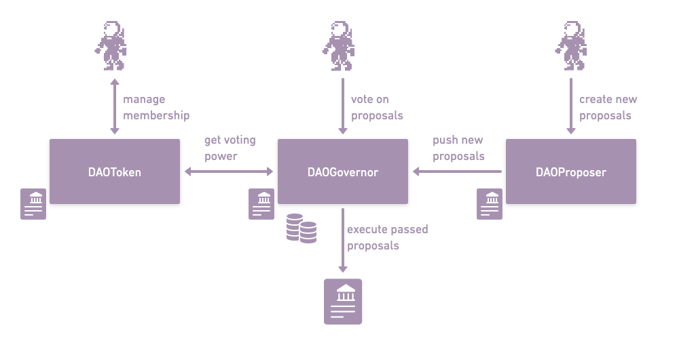

<pre>

</pre>

<div align="center">

</div>

<pre>

</pre>

# Cantodao

Cantodao is a DAO system built on Canto network initiated during [Canto Online Hackathon | Chapter 1, Season 5](https://github.com/the-COH/chapter_1_season_5)

Cantodao is fully open-source, impregnated with the freedom culture of Canto, and is aimed to become the simplest and easiest-to-use DAO system that leverages Canto features such as CSR for contracts launched by organizations.

Interface source code is available at https://github.com/lumtis/cantodao-interface

## Architecture

The smart contract architecture uses the developed and audited governance utilities built by OpenZeppelin. It adds more modifications to allow better UX and simplicity.

The smart contract architecture is composed of the following contracts:

- ### `DAOGovernor`

The core logic of the DAO, the governor orchestrates all the components of the DAO such as voting power determination or proposal creation and execution. This is the main entry point to interact with the DAO.
This is also the contract that executes approved proposals. Contracts that must be administrated by the DAO should be administrated from this address. Finally, this contract holds the treasury of the DAO.

- ### `DAOProposer`

The proposer contract for a DAO is the contract that has the permission to send a new proposal to a DAO. It must contain the logic that allows one to decide who is eligible to create a new proposal.
`DAOProposer` is a simple proposal contract that is fully permissionless, anyone can create a proposal for a contract.

- ### `DAOToken`

It represents the ERC20 contract for the governance token of the DAO that allows to determine voting power when voting on proposals.
It represents the most basic ERC20 tokens where the deployer of the contract choose the initial supply and the funded address. The contract is ownable and should be owned by the DAO to allow minting new governance tokens.
`DAOGovernor` could accept any contract that implements the `IVote` interface for voting power, we currently only have this contract implemented in this project for the sake of simplicity.

- ### `DAOFactory`

This is a simple factory contract to deploy a new DAO with all the components. It creates all the contracts listed above and configure the permissions of the contracts to allow to get an operational DAO only with one method call.

<div align="center">

</div>

## Commands

The project uses the Foundry tooling: https://getfoundry.sh/

Run local network

```
make network
```

Build and test smart contracts

```
make test
```

Deploy the DAO factory locally

```
export PRIVATE_KEY=0xac0974bec39a17e36ba4a6b4d238ff944bacb478cbed5efcae784d7bf4f2ff80
make deploy-factory-local
```

Deploy the DAO factory on testnet

```
export PRIVATE_KEY=[your private key]
make deploy-factory-testnet
```

## Plan

For the sake of the hackathon and because of time constraint, the smart contract architecture has been kept simple and the front-end offers basic functionalities. However, the potential for DAO systems remain still to be further developed and exploring the potential for DAO systems could create a strong synergy with Canto's fully community-owned project structure.

The short term plan for the project includes the following:

- Allow creating DAOs with voting based on existing ERC20 tokens and NFTs
- Allow creating membership-based DAOs
- Support any proposal actions in the front-end interface
- Leverage Canto public goods:
  - UI for CSR token creation and management
  - UI for DAOs to easily provide liquidity in pools, and lending

The long term plan for the project includes the following:

- Add extensive modular functionalities in the smart contract architecture:
  - Custom proposer contract for proposal submission conditions
  - Custom executer contract for custom timelock
  - SubDAOs support
  - Advanced permission structure for members
- Add metadata management in DAOs
- Provide packages for NFT or GameFi projects to integrate DAO in their UI
